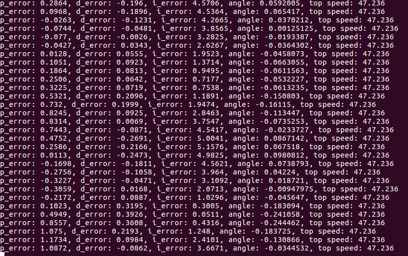

# Particle Filter Project
Self-Driving Car Engineer Nanodegree Program

This project implements a PID (Proportional, Integral, Derivative) controller in C++ for nagivating a car around a test track in a simulator. The speed, angle, and cross-track error (CTE) is read out for each time step in the simulator, and used as input for the PID controller.

## PID controller
The PID controller is a simple feedback algorithm that calculates the desired steering angle of the car based on its CTE, where CTE is the difference between the desired state (center of lane) vs the measured state (position of car). The formula used for determining steering angle is

*steer_angle = -Kp * p_error - Kd * d_error - Ki * i_error*

The error terms correspond to the differnt PID components of the controller. Each error term is multiplied by a prefactor, which determines the strength of that term.

The P term is proportional to the CTE, and steers the car towards the center with larger magnitude the further away it is from the center. Hence *p_error = CTE*.

The D term is proportional to the rate of change (derivative) of the the cte. In the code, it's implemented as *d_error = CTE(t) - CTE(t-1)*, assuming each time step is constant. It's effect is to dampen the oscillations that result from the P term, since as the CTE gets reduced, this term imposes a counter-steering effect in proportion to how fast the CTE is being reduced.

The I term takes into account the sum of the cte over time (integral), which is used to reduce systematic bias. Since this value is an integral which in the code implementation can grow very rapidly and dominate the effect of the controller, I decided to implement a time window over which to integrate the CTE. For my final implementation, I use 10 frames as my integrating window. For my implementation, the error term is given as *sum(CTE(t)...CTE(t-10))*.

## Parameter tuning
Tuning the parameters *Kp*, *Ki*, and *Kd* was much more difficult than implementing the controller. A larger *Kp* results in faster steering towards the center of the lane, which is needed at higher speeds, but also results in more oscillations as the car overshoots the center line, and corrects in the opposite direction. *Kd* and *Ki* parameters can be adjusted to stabilize the motion, but *Ki* is also dependent on the integrating window size, and all parameters also depend on speed.

I implemented a TWIDDLE routine for tuning the parameters, similar to the lesson by Sebastian. The big downfall I found with the routine (at least how I implemented it), is that all three parameters increase/decrease in unison, whereas I found that it is the ratio between the parameters that have the biggest impact. Also my function quickly finds a local max, which is very dependent on where on the test track I start it. 

In the end, I abandoned the TWIDDLE function and did the final tuning by hand. The main approach was to first set a constant speed, vary *Kp* to a stable value, and then introduce *Kd* and *Ki*. This was further complicated when I decided to link the throttle not to a constant value, but rather a function of my steering angle (slower speeds at sharper turns). In the end, the most effect tuning method I found was observing the error terms in the output and adjusting the parameters based on which error term oscillations were causing steering angle oscillations (see final output example below).

## Final parameters
These were my final parameters:

*Kp* = 0.05;
*Ki* = 0.0075;
*Kd* = 0.55;

The throttle value was given by: *max(0.15, .6 - fabs(steer_value) * 3.25)*, which caps out the maximum throttle at 60mph, and the minimum at 15mph. 

Below is a video of the final run. The car had some slight oscillations on straights, but handled turns relatively well, and reached a top speed of 47mph.

